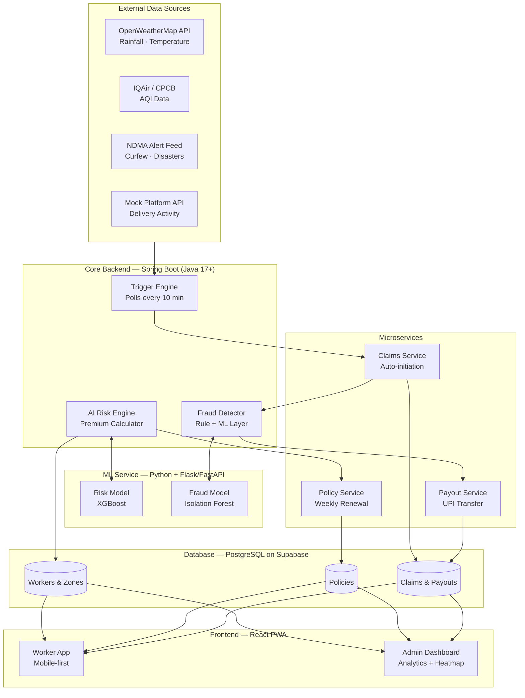
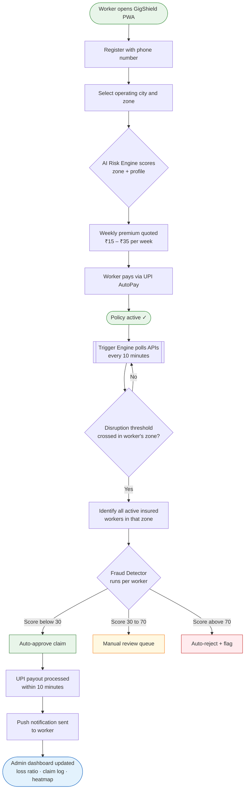
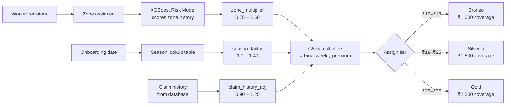
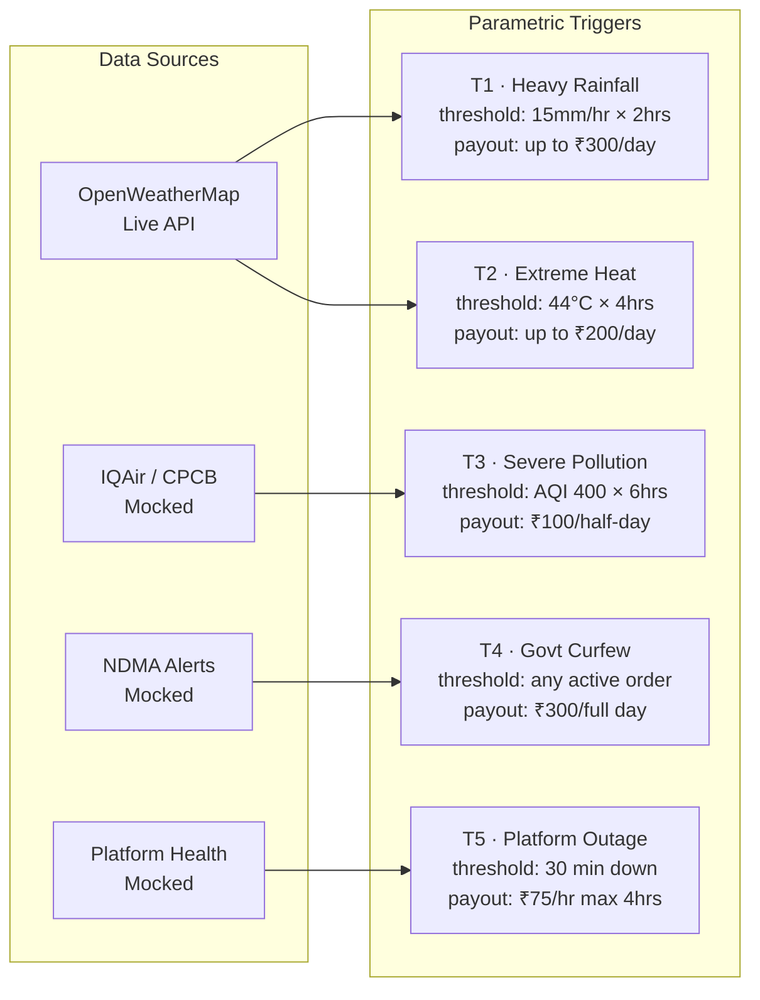
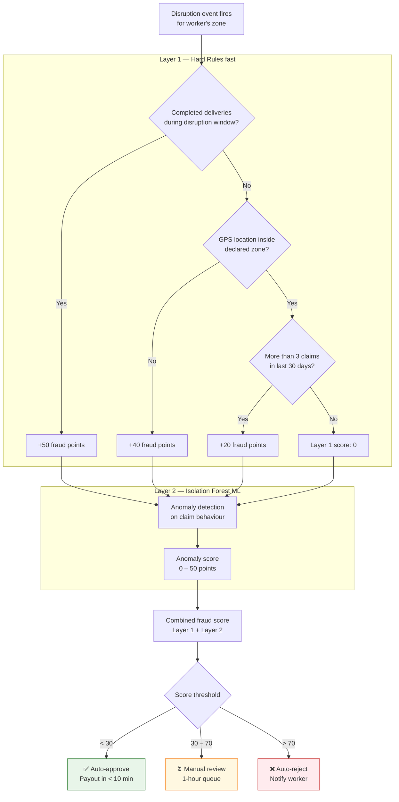
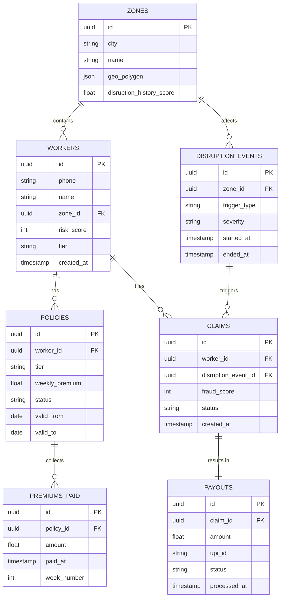

# GigShield 🛡️
### AI-Powered Parametric Income Protection for Food Delivery Partners
**Guidewire DEVTrails 2026 — University Hackathon**

---

## What We're Building

Food delivery partners on Zomato and Swiggy have no protection when external disruptions — heavy rain, extreme heat, city curfews — stop them from working. They lose a full day's income with no recourse. Traditional insurance doesn't help: it requires filing claims, waiting for assessors, and weeks of paperwork that a gig worker simply cannot afford to deal with.

GigShield is a parametric income protection platform. When a measurable disruption event crosses a predefined threshold in a worker's operating zone, the system automatically detects it, validates the claim, and transfers a compensation amount to the worker's UPI account — within minutes, with zero action required from the worker.

> We are **not** building health insurance, accident cover, or vehicle repair coverage.
> We are strictly protecting against **lost daily income** caused by uncontrollable external events.

---

## The Problem at a Glance

```
Traditional Insurance          GigShield
──────────────────────         ──────────────────────
Rain starts                    Rain starts
     ↓                              ↓
Worker loses income            Trigger detected automatically
     ↓                              ↓
Worker files a claim           Fraud check runs (seconds)
     ↓                              ↓
Adjuster investigates          Claim approved automatically
     ↓                              ↓
Decision in 2–6 weeks          ₹250 in UPI within 10 minutes
     ↓
Maybe rejected
```

---

## Persona: Food Delivery Partner (Zomato / Swiggy)

We chose food delivery over e-commerce or grocery delivery for three concrete reasons:

1. **Highest disruption exposure.** Food delivery is entirely outdoor, real-time, and weather-dependent. A heavy rain event causes a 60–80% order drop on Zomato/Swiggy. An e-commerce partner still gets warehouse shifts; a food delivery partner earns nothing.
2. **Largest segment.** Zomato and Swiggy together have approximately 5–6 million active delivery partners — the single largest cohort of gig workers in India.
3. **Cleanest parametric triggers.** Rainfall (mm/hr), temperature (°C), and AQI are objective, publicly available, and directly correlate to food delivery work stoppages. The causality is unambiguous.

---

## Persona-Based Scenarios

### Scenario 1 — Heavy Monsoon Rain (Most Common)

> **Rahul**, 28, delivers for Zomato in Mumbai's Dharavi zone. Average daily earnings: ₹580.
> On July 14, the IMD issues a red alert and rainfall hits 32mm/hr by 11am. Zomato orders
> in his zone drop to near zero. Rahul stays home and earns nothing.
>
> **With GigShield:** At 11:20am, the trigger engine detects rainfall exceeding 15mm/hr
> sustained for 2 hours in Zone MUM-04. Rahul's policy is active and his fraud score is 9 (clean).
> By 11:35am, ₹250 is credited to his UPI. He gets a notification:
> *"Heavy rain detected in your zone. ₹250 transferred to your account. Stay safe."*

### Scenario 2 — Extreme Heat Event (North India Summer)

> **Priya**, 31, delivers for Swiggy in Delhi's Laxmi Nagar zone. Average daily earnings: ₹520.
> In May, a heat wave pushes the temperature to 46°C by 1pm. IMD issues a heat advisory.
> Swiggy's data shows order volumes drop by 55% as restaurants reduce staff.
>
> **With GigShield:** Temperature in Zone DEL-07 exceeds 44°C for 4 continuous hours.
> System triggers an income disruption event. Priya's ₹150 partial-day payout is processed
> automatically. She didn't file anything — she was asleep under a fan.

### Scenario 3 — Fraud Attempt (System Catches It)

> **Vikram**, 25, has an active GigShield policy. On a clear Tuesday afternoon, he attempts
> to claim a disruption payout by spoofing his GPS location to show him inside Zone BLR-02,
> which had a brief rain event. His delivery platform activity log shows 4 completed deliveries
> during the same time window.
>
> **With GigShield:** Fraud score returns 81. Claim is not auto-approved. It enters a manual
> review queue flagged: *"Platform activity detected during claimed disruption window."*

---

## System Architecture



---

## Application Workflow



---

## Weekly Premium Model

Gig workers earn and spend weekly — monthly or annual premiums don't fit their cash flow.
Premiums are auto-deducted weekly via UPI AutoPay, aligned with the typical Zomato/Swiggy payout cycle.

### Pricing Formula

```
weekly_premium = base_rate × zone_multiplier × season_factor × claim_history_adj
```

| Variable | Range | Description |
|---|---|---|
| `base_rate` | ₹20 | Silver tier baseline |
| `zone_multiplier` | 0.75 – 1.60 | Historical disruption frequency of the worker's zone |
| `season_factor` | 1.0 – 1.40 | Peaks during monsoon (June–September) |
| `claim_history_adj` | 0.90 – 1.25 | Slight surcharge for frequent claimants |

### How the Premium Is Calculated



### Example Calculation

Rahul, Dharavi zone (high flood history), July monsoon, no prior claims:

```
₹20  ×  1.40 (high-risk zone)  ×  1.40 (monsoon season)  ×  0.90 (no claims)
= ₹35.28  →  rounded to ₹35/week
```

At ₹580/day earnings, **₹35/week = 0.86% of weekly income** — less than one skipped delivery.

---

## Parametric Triggers

All triggers are based on objective, third-party verifiable data. No worker self-reporting.



| # | Event | Data Source | Threshold | Max Payout |
|---|---|---|---|---|
| T1 | Heavy rainfall | OpenWeatherMap (live) | > 15mm/hr for ≥ 2 hrs | ₹300/day |
| T2 | Extreme heat | OpenWeatherMap (live) | > 44°C for ≥ 4 hrs | ₹200/day |
| T3 | Severe air pollution | IQAir / CPCB (mocked) | AQI > 400 for ≥ 6 hrs | ₹100/half-day |
| T4 | Government curfew | NDMA feed (mocked) | Any active curfew in zone | ₹300/full day |
| T5 | Platform outage | Mock health-check API | > 30 min confirmed outage | ₹300 capped |

---

## Fraud Detection Design



---

## AI / ML Integration Plan

### 1. Risk Scoring Model — XGBoost Classifier

**Purpose:** Assign a risk score (0–100) to each worker at onboarding, which determines tier and base premium.

**Input features:**
- Worker's operating zone (geo-polygon ID)
- Historical disruption events in that zone (last 12 months)
- City tier (metro / tier-2)
- Season at time of onboarding
- Average active hours per day (from simulated platform data)

**Training data:** Synthetic dataset of ~2,000 worker profiles generated using Python (Faker + NumPy), labelled with realistic risk scores.

**Implementation:** scikit-learn XGBoost → `risk_model.pkl` → served via Flask/FastAPI at `/score-risk` → called via REST from Spring Boot backend

---

### 2. Fraud Detection — Rule Engine + Isolation Forest

Layer 1 hard rules run first (fast, no model needed). Layer 2 Isolation Forest runs on behavioural features. The final score is a weighted combination of both layers. See diagram above.

**Training data:** Synthetic claim records, with ~15% labelled as fraudulent using the same rule patterns.

**Implementation:** scikit-learn IsolationForest → `fraud_model.pkl` → served via Flask/FastAPI at `/score-fraud` → called via REST from Spring Boot backend

---

### 3. Predictive Disruption Nudge

Using the OpenWeatherMap 7-day forecast API, a scheduled job checks if high rainfall or heat is expected in any active zone. Workers without active coverage receive a push notification 3 days in advance. This is not ML — it is a scheduled Spring `@Scheduled` task — but it demonstrates proactive UX that traditional insurance never offers.

---

## Database Schema



---

## Tech Stack

| Layer | Technology | Reason |
|---|---|---|
| Frontend | React.js + Tailwind CSS (PWA) | Fast to build, mobile-friendly, no app store |
| Backend | Spring Boot (Java 17+) + Spring Web + Spring Data JPA | Robust, scalable, industry-standard Java backend |
| ML Service | Python 3.11 + Flask/FastAPI + scikit-learn (called via REST from Spring Boot) | Best for quick ML prototyping, integrates seamlessly with Spring Boot |
| Database | PostgreSQL on Supabase (free tier) | Hosted Postgres, easy integration with Spring Boot via JPA |
| Weather API | OpenWeatherMap (free tier) | 1,000 calls/day, clean JSON, reliable |
| AQI / Alerts | Custom API (Spring Boot) | Unified backend, no dependency on Node.js |
| Payments | Razorpay test mode / DB simulation | Supports Java integration, suitable for sandbox use |
| Maps | Leaflet.js + OpenStreetMap | Free, no API key needed |
| Deployment | Vercel (frontend) + Render (Spring Boot backend) + Supabase | All free tiers, supports Java deployment |
| Notifications | Browser Push API (PWA) | No third-party dependency |

---

## Project Structure

```
gigshield/
├── README.md
├── docs/
│   └── architecture-diagram.png
│
├── backend/                        # Spring Boot (Java 17+)
│   ├── src/main/java/com/gigshield/
│   │   ├── controller/
│   │   │   ├── WorkerController.java      # Registration, profile, zone assignment
│   │   │   ├── PolicyController.java      # Create policy, weekly renewal, pricing
│   │   │   ├── ClaimController.java       # Auto-initiation, status, history
│   │   │   └── PayoutController.java      # Trigger and record disbursements
│   │   ├── service/
│   │   │   ├── TriggerEngineService.java  # Polls APIs, checks thresholds every 10 min
│   │   │   ├── FraudDetectorService.java  # Calls ML service + runs rule layer
│   │   │   └── PremiumCalcService.java    # Calls ML service, applies season/history adj
│   │   ├── repository/                    # Spring Data JPA repositories
│   │   ├── model/                         # JPA entity classes
│   │   └── config/
│   │       └── triggers.json              # Threshold config (editable without code change)
│   ├── src/main/resources/
│   │   ├── application.yml
│   │   └── schema.sql
│   └── pom.xml
│
├── ml-service/                     # Python + Flask/FastAPI
│   ├── app.py                      # /score-risk and /score-fraud endpoints
│   ├── models/
│   │   ├── risk_model.pkl
│   │   └── fraud_model.pkl
│   ├── training/
│   │   ├── generate_synthetic_data.py
│   │   └── train.py
│   └── requirements.txt
│
├── frontend/                       # React PWA
│   ├── src/
│   │   ├── pages/
│   │   │   ├── Onboarding.jsx
│   │   │   ├── WorkerDashboard.jsx
│   │   │   └── AdminPanel.jsx
│   │   └── components/
│   │       ├── DisruptionSimulator.jsx   # "Trigger fake rainstorm" button for demo
│   │       ├── RiskHeatmap.jsx           # Leaflet.js zone map
│   │       └── PremiumCard.jsx
│   └── package.json
│
└── mock-apis/                      # Simulated external feeds (Spring Boot controllers)
    ├── WeatherMockController.java
    ├── AqiMockController.java
    ├── CurfewAlertMockController.java
    └── PlatformActivityMockController.java
```

---

## Assumptions and Honest Limitations

We're being upfront about what this is and isn't at the hackathon stage:

**What is real:**
- Trigger engine logic runs on live OpenWeatherMap data for T1 and T2
- Risk scoring model is genuinely trained (on synthetic data, but trained)
- Dynamic premium calculation actually changes based on model output and season
- Fraud detection actually produces a score — it is not hardcoded
- All claim and payout records are real database entries

**What is mocked or simulated:**
- T3 (AQI), T4 (curfew), T5 (platform outage) use mock Spring Boot controllers with controlled JSON
- Delivery platform activity (Zomato/Swiggy have no public API) is simulated
- UPI payout is a database write + notification — not a live bank transfer
- KYC verification is a checkbox — not integrated with Aadhaar
- Training data for ML models is synthetic — not real historical worker data

These are the honest constraints of a university hackathon. The architecture is designed so every mocked component can be swapped with a real integration in production.

---

## Team

| Name | Role | Responsibilities |
|---|---|---|
| [Team Member 1] | Backend Lead — Spring Boot Core | Spring Boot project setup, REST controllers (Workers, Policies, Claims, Payouts), Spring Data JPA entities & repositories, Supabase/PostgreSQL integration, application configuration |
| [Team Member 2] | Backend — Trigger Engine & Integrations | TriggerEngineService (scheduled polling every 10 min), OpenWeatherMap API integration, PremiumCalcService, mock API controllers (AQI, Curfew, Platform Activity), Razorpay sandbox integration |
| [Team Member 3] | ML Engineer — Python Service | Synthetic data generation, XGBoost risk model training, Isolation Forest fraud model training, Flask/FastAPI service with `/score-risk` and `/score-fraud` endpoints, REST integration with Spring Boot |
| [Team Member 4] | Frontend Developer — React PWA | React PWA setup with Tailwind CSS, Onboarding & WorkerDashboard pages, PremiumCard & DisruptionSimulator components, UPI deep links, Browser Push API notifications |
| [Team Member 5] | Frontend — Admin Dashboard & QA | AdminPanel page, RiskHeatmap with Leaflet.js + OpenStreetMap, end-to-end integration testing, demo data seeding, pitch deck & 5-min demo video |

---

## License

MIT License — open for educational purposes.
